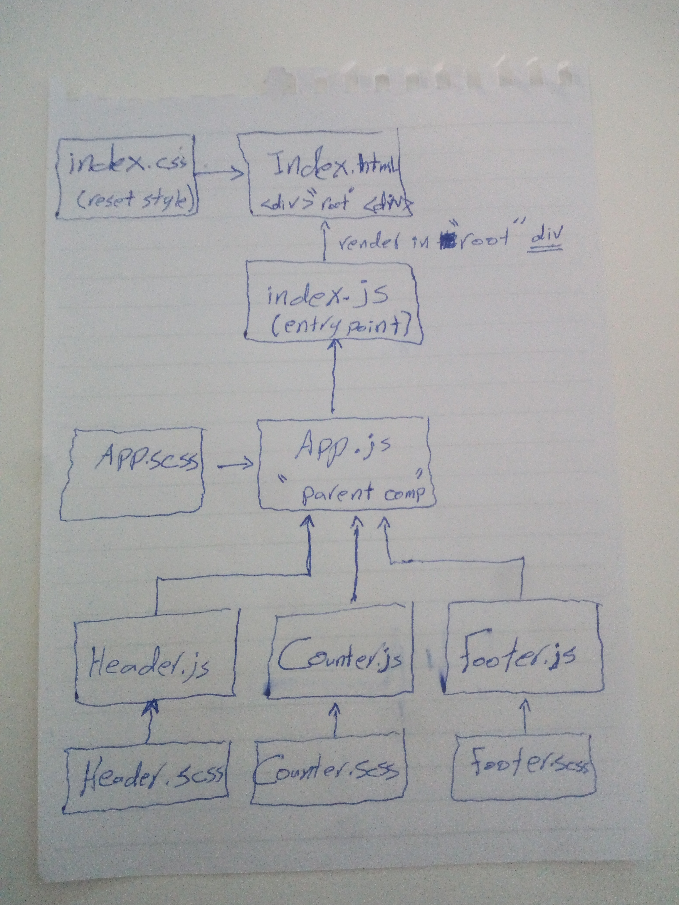

# LAB - Class 28

### Author: Ayman khawaldeh

### Links and Resources

- [submission PR]()
- [ci/cd]() (GitHub Actions)

### Setup
npm i react enzyme gh-pages node-sass

#### How to initialize/run your application (where applicable)

- `npm run test`
- `npm run start`

#### Tests

- How do you run tests?
     - 'npm test'
- Any tests of note?
     - jest --verbose --coverage
- Describe any tests that you did not complete, skipped, etc
     - evey test solved and another time i will cover more cases.

### [Deployment Link in netlify]()

### [Deployment Link in GitHub](https://401-advanced-javascript-qusaialhanaktah.github.io/lab-28/)

### Author: Ayman khawaldeh
#### Group Members : -Qusay Hanaqtah -Ayman Khawaldeh  -Mohammad Hawamdeh

#### UML
Link to an image of the UML for your application and response to events

